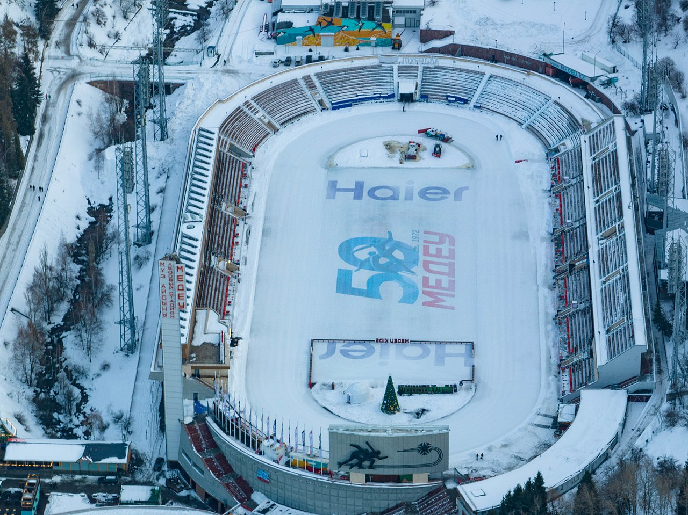

## Overview

The Medeu is an outdoor speed skating and bandy rink. It is located in a mountain valley on the south-eastern outskirts of Almaty, Kazakhstan. Medeu sits 1,691 metres above sea level. It consists of 10.5 thousand square meters of ice and utilizes a sophisticated freezing and watering system to ensure the quality of the ice.

## History

The Medeu is a high-altitude sports complex near Almaty, located at an altitude of 1691 meters above sea level. It is considered to be the world's largest high-mountain skating rink. The skating rink was named after the Maloalmatinsky volost Medeu Pusurmanov. He built three wooden huts for the wintering of his family there, and began the development of the tract in the foothills of the Zailiysky Alatau. Medeu became a well-known entrepreneur, patron of educational institutions, and participated in the planting of the city.